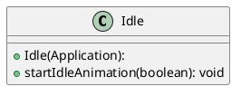

# Idle

Just run `startIdleAnimation()` and the robot will go into a idle pose.

## PlantUML diagram

```puml
@startuml

class Idle {
  + Idle(Application):
  + startIdleAnimation(boolean): void
}

@enduml
```
