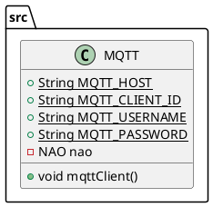

# MQTT

The MQTT class consist of a MQTT client that has the ability to subscribe to a topic 
and listen to recieved messages. 

After receiving a message, it gets checked to see if it's a call to start another function in the project.

## PlantUML diagram

