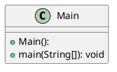

# Main

This is used as the entry point for the java part of the project.
It just starts the rest of the application.

## PlantUML diagram

```puml
@startuml

class Main {
  + Main():
  + main(String[]): void
}

@enduml
```
