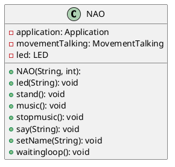

# NAO

[◄ back to index](../index.md)

In this class we connect to the NAO. After that the NAO can be controlled with methods from other classes.

## PlantUML diagram

```puml
@startuml

class NAO {
+ NAO(String, int):
- application: Application
- movementTalking: MovementTalking
- led: LED
+ led(String): void
+ stand(): void
+ music(): void
+ stopmusic(): void
+ say(String): void
+ setName(String): void
+ waitingloop(): void
  }

@enduml
```
