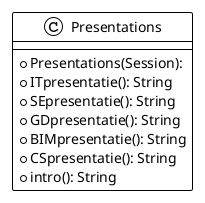

# Presentations

[◄ back to index](../index.md)

The presentation class has several methods with information about the routes. These methodes can be used to let the NAO say.

## Plantuml

```puml
@startuml

!theme plain
top to bottom direction
skinparam linetype ortho

class Presentations {
+ Presentations(Session):
+ ITpresentatie(): String
+ SEpresentatie(): String
+ GDpresentatie(): String
+ BIMpresentatie(): String
+ CSpresentatie(): String
+ intro(): String
  }

@enduml
```
