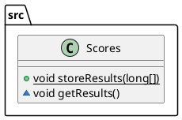

# Scores

[◄ back to index](../index.md)

The scores class has two functions, storeResults() and getResults().
These functions work like expected.

## storeResults()

Store results gets given the scores array from the questionaire [logic](logic.md) and adds it to the total scores in the [scores.json](../config/Scores.md).

## getResults()

Ger results retrieves all the scores in the [scores.json](../config/Scores.md) and prints it in a nice format.

```text
score-robot-ui: 225
score-robot-technical: 205
score-back-end: 185
score-front-end: 205
score-ict-ondernemer: 230
```

## PlantUML diagram


