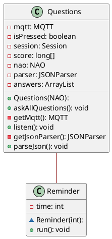

# Scores

This is the class that asks the user questions.
First it reads `config/scores.json` for the questions.
Then it asks the question and waits for input via mqtt.
It reminds the student to answer after 10 seconds.
After all the questions have been answered it tells another class to generate an image with the results.

## PlantUML diagram

