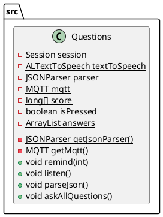

# Main Logic

[◄ back to index](../index.md)

The Main Logic of the study check revolves around asking questions, listening for answers.
and storing the values of score for each field.

## PlantUML diagram

